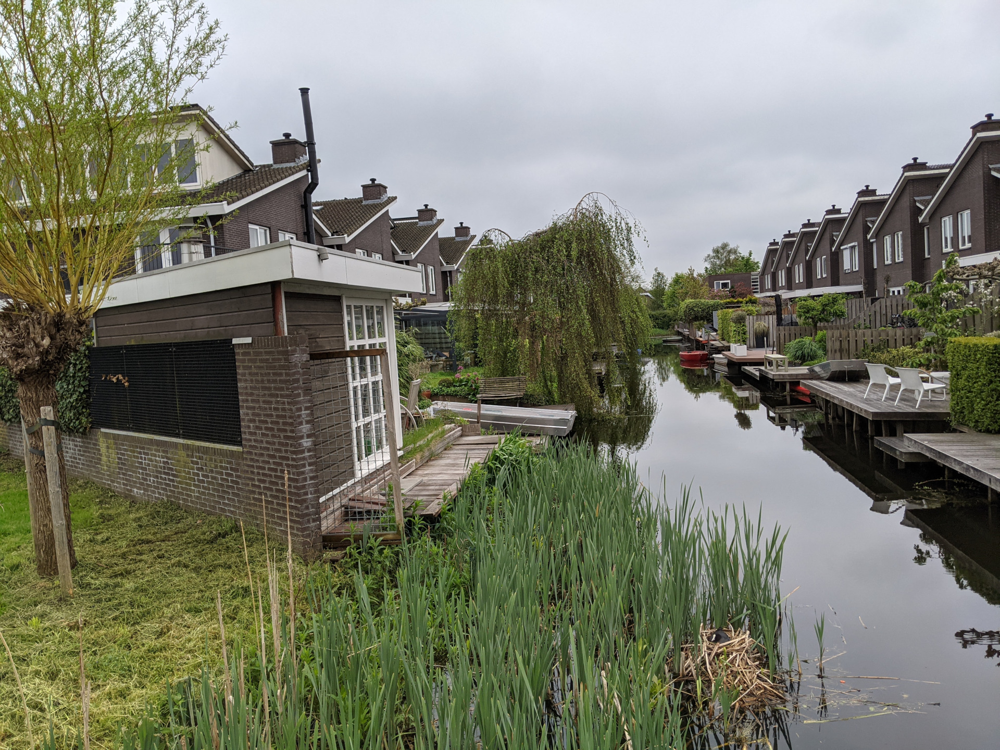

# Adventures in TensorFlow
TensorFlow is not just about Neural Networks. In this repository, I'll show some examples of traditional Image Processing algorithms implemented with simple pythonic TensorFlow.

## Image Registration
<div align="center">



</div>
Running:

```bash
python main.y align images/sample1_a.jpg images/sample1_b.jpg
```

> Tip: Use the `--help` flag to find out other cool options