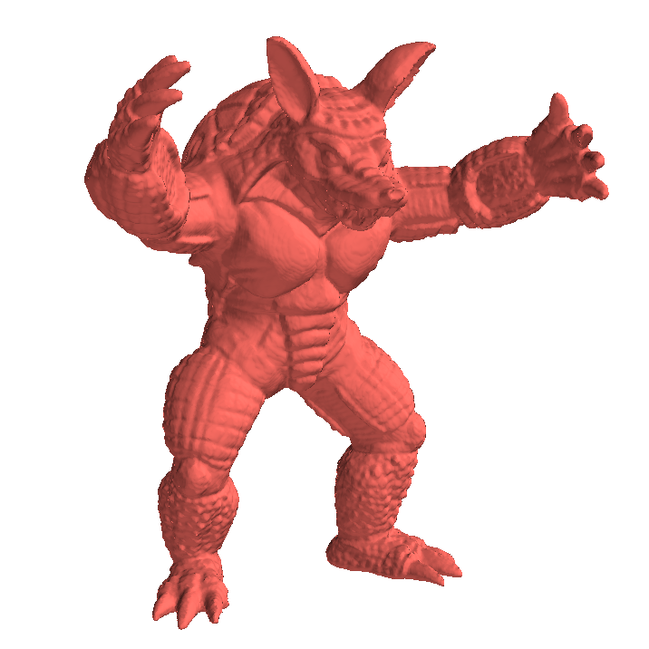
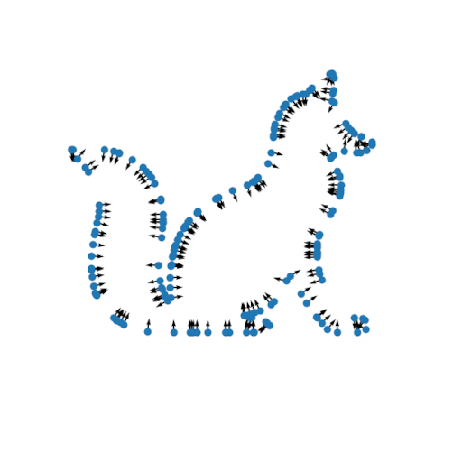
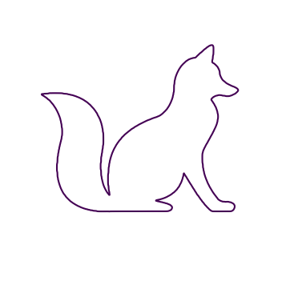

# Adventures in TensorFlow
TensorFlow is a very powerful tool. Although its most common uses are in the design of neural networks, it can easily be used for solving general numerical problems while leveraging the power of GPUs.
This repository contains demo solutions for interesting problems in Computer Vision.

> Tip: Use the `--help` flag to find out other cool options are supported by the demos

## Surface Reconstruction
<div align="center">



</div>

This demo follows the spirit of [Kazhdan et al](#kazhdan2007) and solves the surface reconstruction problem by computing a scalar field whose laplacian equals de divergent of the inwards normals obtained from the input point cloud. These normals are estimated from the two largest components from a local Principal Component Analysis around the neighborhood of each point.

The main difference from the original work is that this demo solves the Poisson equation in a discretized volume rather than an octree. It is also not concerned with triangulating the resulting surface, leaving the visualization job to Mayavi by plotting the isosurface corresponding to the average value of the scalar field evaluated at the input point cloud.

The demo is also available for 2d curves.
<div align="center">



</div>

> **Note:** This demo is currently only implemented in *numpy*.

### Running
#### 3D surfaces
```bash
python main.py import-point-cloud data/point_clouds/armadillo --output armadillo.npz
python main.py surface-reconstruction-3d armadillo.npz --output volume_armadillo.npz
```
#### 2D curves
```bash
python main.py surface-reconstruction-2d data/svg/fox.svg
```

### References
- <a name="kazhdan2007"></a> Michael Kazhdan, Matthew Bolitho, and Hugues Hoppe. 2006. Poisson surface reconstruction. In Proceedings of the fourth Eurographics symposium on Geometry processing (SGP '06). Eurographics Association, Goslar, DEU, 61–70.

## Video Motion Amplification
<div align="center">

</div>

This is a simplified variant of the motion magnification technique of [Wadhwa et al](#wadhwa2013). This algorithm decomposes the input video into a representation that allows them to infer the spatial phases of each pixel in a localized way. The local phases of each reference frame is removed from all subsequent frames, which leaves the temporal component of the phases. This component is then manipulated and added back to the original signals.

> **Note:** This demo is currently only implemented in *numpy*.

### Running
```bash
python main.py motion-amplification data/videos/baby.avi --show-progress \
                                    --max-frames 90 --intensity 10
```

### References
- <a name="wadhwa2013"></a>Neal Wadhwa, Michael Rubinstein, Frédo Durand, and William T. Freeman. 2013. Phase-based video motion processing. ACM Trans. Graph. 32, 4, Article 80 (July 2013), 10 pages.

## Rectified Stereo Matching
<div align="center">


</div>

This demo is inspired by the technique from [Steinbrucker et al](#steinbrucker2009), where the objective function is optimized in alternating steps with respect to two independent variables `v` (the desired disparity map) and `u` (an auxiliary flow).
As the name suggests, the input images are expected to be [rectified](https://en.wikipedia.org/wiki/Image_rectification).

### Running
```bash
python main.py rectified-stereo --left data/stereo/motorcycle/im_left.png \
                                --right data/stereo/motorcycle/im_right.png \
                                --groundtruth data/stereo/motorcycle/gt.npz
```

### References
- <a name="steinbrucker2009"></a>Steinbrucker, Frank & Pock, Thomas & Cremers, Daniel. (2009). Large Displacement Optical Flow Computation without Warping. Proceedings of the IEEE International Conference on Computer Vision.

## Image Registration
<div align="center">


</div>
This demo implements a dense image tracker, which required defining an image sampler operation with custom gradient with respect to the input coordinates. It also implements some tricks to increase robustness to relatively large displacements between the input images (namely coarse-to-fine processing of images using different levels of blurring and scales).

### Running

```bash
python main.py image-registration data/pairs/sample1_a.jpg \
                                  data/pairs/sample1_b.jpg
```