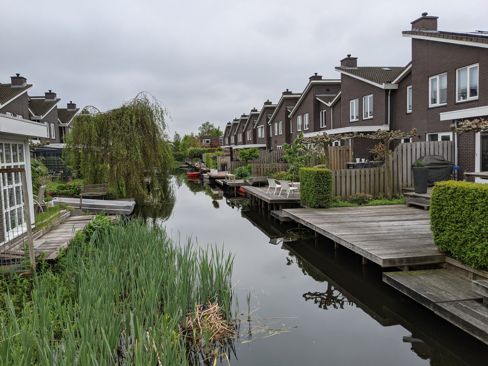

# Adventures in TensorFlow
TensorFlow is a very powerful tool. Although its most common uses are in the design of neural networks, it can easily be used for solving general numerical problems while leveraging the power of GPUs.
This repository contains demo solutions for interesting problems in Computer Vision.

> Tip: Use the `--help` flag to find out other cool options are supported by the demos

## Rectified Stereo Matching
<div align="center">


</div>

This demo is inspired by the technique from [Steinbrucker et al](#steinbrucker2009), where the objective function is optimized in alternating steps with respect to two independent variables `v` (the desired disparity map) and `u` (an auxiliary flow).
As the name suggests, the input images are expected to be [rectified](https://en.wikipedia.org/wiki/Image_rectification).

### Running
```bash
python main.py rectified-stereo --left data/stereo/motorcycle/im_left.png \
                                --right data/stereo/motorcycle/im_right.png \
                                --groundtruth data/stereo/motorcycle/gt.npz
```

### References
- <a name="steinbrucker2009"></a>Steinbrucker, Frank & Pock, Thomas & Cremers, Daniel. (2009). Large Displacement Optical Flow Computation without Warping. Proceedings of the IEEE International Conference on Computer Vision.

## Image Registration
<div align="center">



</div>
This demo implements a dense image tracker, which required defining an image sampler operation with custom gradient with respect to the input coordinates. It also implements some tricks to increase robustness to relatively large displacements between the input images (namely coarse-to-fine processing of images using different levels of blurring and scales).

### Running

```bash
python main.py image-registration data/pairs/sample1_a.jpg \
                                  data/pairs/sample1_b.jpg
```